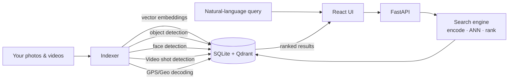

# Media Search Agent

[](https://github.com/openara-ai/media-search-agent/actions)
[](LICENSE)
[](#quick-start)

A **local-first semantic search engine** for your personal photo and video library developed using [Agentic Engineering](#How-this-was-built).
Search by natural language, browse by face, label people — all on your own machine.
No cloud. No subscription.

## Demo


*Sharper, smaller version: [docs/images/demo.mp4](docs/images/demo.mp4) (1.5 MB, 720p).*

## How this was built

This project was developed using agentic workflow with AI coding agents as code authors. See [AGENTIC_DEVELOPMENT.md](docs/AGENTIC_DEVELOPMENT.md) for the playbook: spikes, ADRs, multi-agent code review, guardrails, per-agent instruction files.


## Highlights

- 🖼️ **Natural-language search** — "sunset at the beach", "blue car at night", "kids playing in snow". A vision-language model encodes image and text into the same vector space, so queries find matching frames even without any tags.
- 🎬 **Video Shot detection** — shot-based keyframe extraction; semantic search jumps to the moment within a clip, not just to the file.
- 👥 **People browser** — faces are detected during indexing. Label one face and use similarity search to pull in the rest of that person's photos and video appearances.
- 🏷️ **Object & scene tagging** — object detection across images and video frames; query "show me photos with dogs."
- 📍 **GPS & metadata** — EXIF location (including GoPro GPS data), camera, lens, timestamp all parsed and searchable.
- 🔒 **Fully offline** — Apple Silicon MPS, NVIDIA CUDA, or CPU. Nothing phones home.
- ⚡ **Fast** — embedded Qdrant for vector search, SQLite for metadata. No external services.
- 🖥️ **Native desktop app** — self-contained app on macOS and Windows with signed auto-update; Linux and servers run the same engine headless in the browser.

## Quick start

macOS and Windows install a native desktop app; Linux runs headless in your browser.
Your existing Python is left untouched, and everything uninstalls cleanly. Full setup,
requirements, and troubleshooting are in the [Installation guide](docs/INSTALL.md).

### macOS — Apple Silicon (M1/M2/M3/M4)

Download the latest **`.dmg`** from the [Releases page](https://github.com/openara-ai/media-search-agent/releases/latest), open it, and drag **MediaSearchAgent** into Applications. Launch it — the app sets itself up on first run.

### Windows 11

Download the latest **`setup.exe`** from the [Releases page](https://github.com/openara-ai/media-search-agent/releases/latest) and run it (per-user, no admin). Launch **MediaSearchAgent** from the Start menu — it sets itself up on first run.

### Linux (and servers / headless)

```bash
curl -fsSL https://github.com/openara-ai/media-search-agent/releases/latest/download/install.sh | bash
```

Serves the UI in your browser at <http://localhost:8000>; add `--headless` for servers/CI.

Then add a media folder on the **Indexer** page, click **Run**, and search — see the [Quick Start guide](docs/QUICKSTART.md) for a full walkthrough with screenshots.

## How it works



The indexer runs over your library when you start it from Indexer page. A
vision-language model encodes images and text into a shared vector space, so a
query like "rainy street at night" finds matching frames without any manual
tagging. SQLite is the canonical store for metadata and embeddings; Qdrant
powers fast vector search at runtime. At query time, the same model encodes
your text into a vector, Qdrant returns the nearest neighbors, and the search
engine ranks them by similarity and metadata filters before they reach the
UI. The React UI talks to a local FastAPI backend — embedded in the native
desktop window on macOS and Windows, or served in your browser at port 8000 on
Linux and headless installs.

For the full design — schema, dataflow, indexing pipeline, search ranking —
see [docs/ARCHITECTURE.md](docs/ARCHITECTURE.md).

## Privacy

- **All ML inference runs locally.** Apple Silicon MPS, NVIDIA CUDA, or CPU.
- **No telemetry. No analytics.** The app does not send any usage data anywhere.
- **The only network calls** are the model downloads on first run — CLIP
  weights from OpenAI's CDN, RT-DETR from Hugging Face, facenet-pytorch
  from its project GitHub releases. After that, the app works fully offline.
- **Your media stays on disk.** The app reads from your library; it does not
  upload, copy, or relocate your files.

## Documentation

### User guides

- [Architecture](docs/ARCHITECTURE.md) — system design, dataflow, schema
- [Installation](docs/INSTALL.md) — full install guide and troubleshooting
- [Quick Start](docs/QUICKSTART.md) — first-run walkthrough
- [Configuration](docs/CONFIGURATION.md) — `config.yaml` reference
- [CLI](docs/CLI.md) — `msa` command-line reference
- [Search](docs/features/search.md) — scoring, threshold tips
- [People](docs/features/people.md) — face labeling user guide
- [Video](docs/features/video.md) — keyframe extraction and video search
- [FAQ](docs/FAQ.md)

### Engineering references

- [Agentic Development](docs/AGENTIC_DEVELOPMENT.md) — how this project was built: spikes, ADRs, multi-agent review, guardrails
- [Architecture Decision Records](docs/decisions/) — the 10 ADRs governing this codebase
- [Spikes](docs/spikes/) — time-boxed investigations that fed the ADRs


## Status

MediaSearchAgent is pre-1.0, experimental software developed through human-led, AI-assisted agentic coding. Use at your own risk. Keep your original media backed up. It is tested and usable today on macOS, Windows, and Linux, but not intended for production use.

## Contributing

See [CONTRIBUTING.md](CONTRIBUTING.md) for full guidelines, including a note on
AI-assisted contributions and the dev environment setup.

## License

Source code is released under the [MIT License](LICENSE).

This project bundles third-party components under their respective licenses.
See [NOTICE](NOTICE) for the full third-party notices.

## Acknowledgements

Built on excellent open-source work:
[CLIP](https://github.com/openai/CLIP) (OpenAI),
[RT-DETR](https://github.com/lyuwenyu/RT-DETR),
[facenet-pytorch](https://github.com/timesler/facenet-pytorch),
[Qdrant](https://github.com/qdrant/qdrant),
[FastAPI](https://github.com/tiangolo/fastapi),
[React](https://react.dev/),
[Tauri](https://tauri.app/),
[uv](https://github.com/astral-sh/uv),
[ExifTool](https://exiftool.org/),
[MediaInfo](https://mediaarea.net/MediaInfo).
