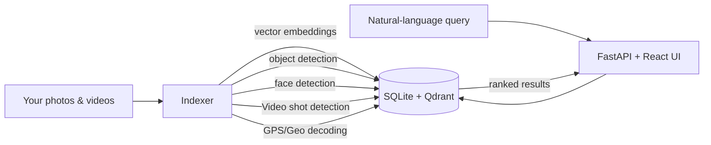

# Media Search Agent

[](https://github.com/openara-ai/media-search-agent/actions)
[](LICENSE)
[](#install)

A **local-first semantic search engine** for your personal photo and video library.
Search by natural language, browse by face, label people — all on your own machine.
No cloud. No subscription.

## Demo


*Sharper, smaller version: [docs/images/demo.mp4](docs/images/demo.mp4) (1.5 MB, 720p).*

## Highlights

- 🖼️ **Natural-language search** — "sunset at the beach", "blue car at night", "kids playing in snow". A vision-language model encodes image and text into the same vector space, so queries find matching frames even without any tags.
- 🎬 **Video Shot detection** — shot-based keyframe extraction; semantic search jumps to the moment within a clip, not just to the file.
- 👥 **People browser** — automatic face clustering. Label a person once and browse all their photos and video appearances.
- 🏷️ **Object & scene tagging** — object detection across images and video frames; query "show me photos with dogs."
- 📍 **GPS & metadata** — EXIF location (including GoPro GPS data), camera, lens, timestamp all parsed and searchable.
- 🔒 **Fully offline** — Apple Silicon MPS, NVIDIA CUDA, or CPU. Nothing phones home.
- ⚡ **Fast** — embedded Qdrant for vector search, SQLite for metadata. No external services.

## Install

Use the one-liner install. No admin rights, no git, no Node required.

```bash
# macOS / Linux (x86_64)
curl -fsSL https://github.com/openara-ai/media-search-agent/releases/latest/download/install.sh | bash

# Windows (PowerShell 5.1+)
powershell -c "irm https://github.com/openara-ai/media-search-agent/releases/latest/download/install.ps1 | iex"
```

The installer downloads a pre-built bundle from GitHub Releases, sets up a
Python environment, and starts the service. Open <http://localhost:8000> in
your browser.

## Quick start

1. **Install** (above).
2. **Add a media folder** in the **Indexer** page (e.g. your Photos folder).
3. **Click "Run Indexer"** — embeddings start generating. You can browse items as they're processed; semantic search comes online once the run completes.

That's it. Type "kids on a swing" into the search bar and the moments appear.

See the [Quick Start guide](docs/QUICKSTART.md) for the full walkthrough with screenshots.

## How it works



The indexer runs over your library when you start it from Indexer page. A
vision-language model encodes images and text into a shared vector space, so a
query like "rainy street at night" finds matching frames without any manual
tagging. SQLite is the canonical store for metadata and embeddings; Qdrant
powers fast vector search at runtime. The React UI talks to a single FastAPI
process at port 8000.

For the full design — schema, dataflow, indexing pipeline, search ranking —
see [docs/ARCHITECTURE.md](docs/ARCHITECTURE.md).

## Privacy

- **All ML inference runs locally.** Apple Silicon MPS, NVIDIA CUDA, or CPU.
- **No telemetry. No analytics.** The app does not send any usage data anywhere.
- **The only network calls** are the model downloads on first run — CLIP
  weights from OpenAI's CDN, RT-DETR from Hugging Face, facenet-pytorch
  from its project GitHub releases. After that, the app works fully offline.
- **Your media stays on disk.** The app reads from your library; it does not
  upload, copy, or relocate your files.

## Documentation

- [Architecture](docs/ARCHITECTURE.md) — system design, dataflow, schema
- [Installation](docs/INSTALL.md) — full install guide and troubleshooting
- [Quick Start](docs/QUICKSTART.md) — first-run walkthrough
- [Configuration](docs/CONFIGURATION.md) — `config.yaml` reference
- [Search](docs/features/search.md) — scoring, threshold tips
- [People](docs/features/people.md) — face labeling user guide
- [Video](docs/features/video.md) — keyframe extraction and video search
- [FAQ](docs/FAQ.md)

## Status

MediaSearchAgent is pre-1.0, experimental software developed through human-led, AI-assisted agentic coding. Use at your own risk. Keep your original media backed up. It is tested and usable today on macOS, Windows, and Linux, but not intended for production use.

## Contributing

Pull requests and bug reports are welcome. Please open an issue before
starting large changes.

Dev environments are **macOS** and **WSL2 / Linux** (no Windows-native dev
path — Windows contributors should work inside a WSL2 Ubuntu shell). Clone
the repo and run `bash scripts/dev-setup.sh`. Run tests with
`bash scripts/run-tests.sh`. Branch from `main`, open a PR — CI runs the
full test matrix.

## License

Source code is released under the [MIT License](LICENSE).

This project bundles third-party components under their respective licenses.
See [NOTICE](NOTICE) for the full third-party notices.

## Acknowledgements

Built on excellent open-source work:
[CLIP](https://github.com/openai/CLIP) (OpenAI),
[RT-DETR](https://github.com/lyuwenyu/RT-DETR),
[facenet-pytorch](https://github.com/timesler/facenet-pytorch),
[Qdrant](https://github.com/qdrant/qdrant),
[FastAPI](https://github.com/tiangolo/fastapi),
[React](https://react.dev/),
[uv](https://github.com/astral-sh/uv),
[ExifTool](https://exiftool.org/),
[MediaInfo](https://mediaarea.net/MediaInfo).
