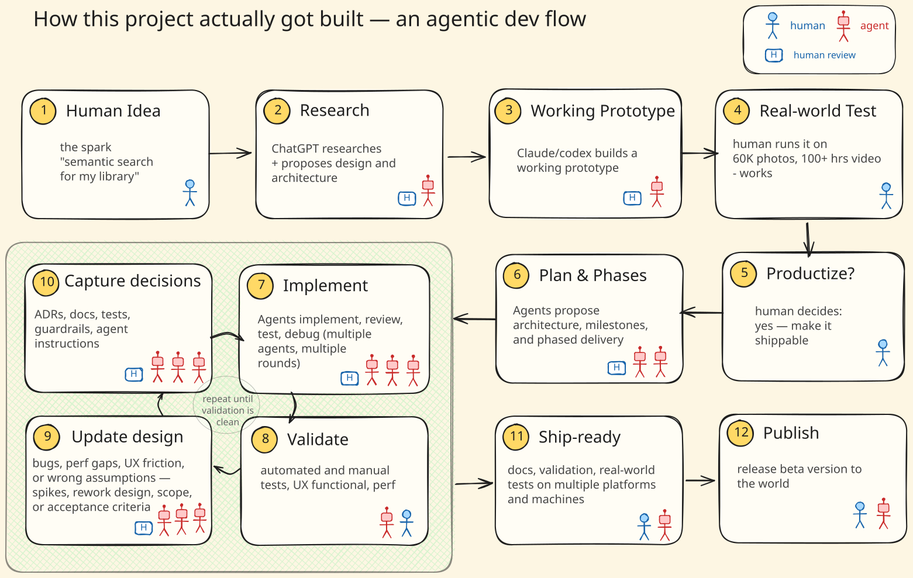
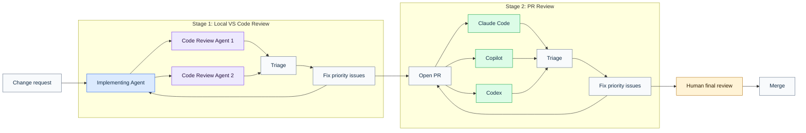
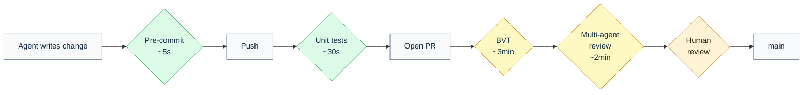
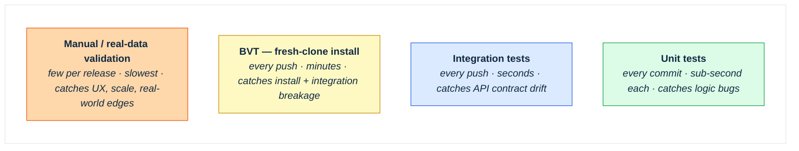

# Agentic Development — How This Project Was Built

> **As of May 2026.** Tooling and practices change fast; treat this as a snapshot.
> Significant shifts will be noted in `CHANGELOG.md`.

This document is a record of how this project was actually built — a real
codebase with real users, developed end-to-end through AI-assisted engineering.
It's intended as a **learning artifact** as much as project documentation:
useful to anyone exploring how AI coding agents work on non-trivial,
ship-quality projects. (That framing is part of the
[openara.ai](https://openara.ai) practice of **agentic engineering** —
shortening idea-to-ship cycles while maintaining production-quality
engineering discipline.)

MediaSearchAgent is **Phase 1** of an idea-to-ship journey:

**Phase 1 — exploratory.** A local-first AI media search app for your own
photos and videos, shipped on macOS, Windows, and Linux. Built with AI coding
agents deliberately *without* imposing a pre-existing methodology, to learn
what agents can and can't do when allowed to drive — where they shine, where
they drift, where they break. The app itself shipped; the methodology emerged
alongside it.

**Phase 2 — applied.** Phase 2 takes the same idea — rediscovering forgotten
moments — to the devices where moments actually get shared (your phone, your
chat apps). It also brings deliberate methodology: lessons from Phase 1
applied, metrics tracked, and the emerging methodology stress-tested against
a harder problem. Phase 2 will get its own retrospective when it ships.

The workflow patterns documented in this doc — spike-then-ADR, per-agent
instruction files, the two-stage code review loop, the guardrail stack — were
not borrowed from a methodology playbook. Each one was added *during* Phase 1
in response to a specific failure mode:

- The **spike pattern** was formalized after the InsightFace license discovery
  forced a third-party dependency swap mid-build.
- **ADRs** became a habit after an agent re-litigated an already-decided
  architectural question in a fresh session and produced a contradictory
  answer.
- The **BVT** was added after a green-CI PR broke the installer on a clean
  machine.

What follows is the distilled Phase 1 methodology — the patterns that
survived, each annotated with the trigger that made it stick. It's the honest
version: what worked, what didn't, where the human had to intervene, and what
the practice of agentic engineering looks like in real engineering work. The
Phase 1 journey that produced these patterns was messier than the table of
contents suggests; this doc captures only what's worth carrying forward — to
Phase 2 and to anyone else building in a similar style.

---

## The workflow loop

**At a glance.**

- **Exploration (Stages 1–4):** human idea → ChatGPT scopes design and architecture → a coding agent builds a working prototype → the human tests it on real data (here, 60K photos and 100+ hours of video). The goal of this arc is *learning whether the result meets human requirements*, not shipping.
- **Decision and plan (Stages 5–6):** the human decides whether to invest, then agents propose architecture, milestones, and phased delivery — turning a yes/no into concrete deliverables.
- **Build Loop (Stages 7–10):** the inner cycle most iterations actually live in — **Build → Validate → Redesign → Capture decisions** — repeated until validation runs cleanly. Agents do the implementation, the validation runs, the spikes, and the first-draft ADRs; humans steer the design choices and approve the captured decisions. The dashed *repeat* arrow closes the cycle back to Build.
- **Release (Stages 11–12):** docs, platform validation, and real-world tests get the build to ship-ready, then publish a beta.

Read the icons as a map of who's doing what: **humans sit at the edges** (the framing, the real-world validation, the "is this worth productizing?" call, the steering when reality contradicts the plan), and **agents sit in the middle** (the research, the typing, the implementation, the first-draft ADRs). The **H** badge marks boxes where humans stay engaged even though agents do the heavy lifting — inside the Build Loop, the work is collaborative throughout, not just at its edges.

---

## Spikes

A spike is a time-boxed exploration to reduce risk before committing to an architecture.

### Pattern

1. **Frame the question in a `SPIKE-<topic>.md`** — what are we deciding, what are
   the candidates, what's the success criterion, what's out of scope.
2. **AI runs 1-N implementations** against the question. Often in parallel — different
   approaches, same harness.
3. **The spike doc captures findings**: what worked, what didn't, recommendation.
4. **Recommendation feeds an ADR.** Throwaway code is deleted; the writeup remains.

### Real examples in this project

| Spike | Question | Outcome |
|---|---|---|
| [`SPIKE-insightface-replacement`](spikes/SPIKE-insightface-replacement.md) | Is there a viable, privacy-friendly alternative to InsightFace? | Adopted `facenet-pytorch`. Fed into an ADR-style decision; InsightFace was replaced. |
| [`SPIKE-gopro-video-gps`](spikes/SPIKE-gopro-video-gps.md) | Is GoPro video GPS extraction feasible with our stack? | Confirmed feasible before building the feature end-to-end. |

---

## Architecture Decision Records (ADRs)

Most significant decisions are documented as a numbered ADR in
[`decisions/`](decisions/). The set covers everything from "use embedded Qdrant
instead of Docker" to "store user-native paths everywhere and convert at access
time."

How ADRs are used in this project:

- **As prior-decision context.** AI agents have no memory across sessions; an
  ADR is what the agent reads (or is pointed at) so a previously-settled
  question isn't re-opened in a fresh session.
- **As constraint context for in-area changes.** When an agent edits code in
  an area governed by an ADR, the ADR is referenced in the change brief so the
  agent works within the decision rather than around it.

The ADR template is intentionally lightweight: context, decision, consequences.

---

## Per-agent instruction files

Three repo-root files act as the persistent instruction layer for AI agents:

- [`CLAUDE.md`](../CLAUDE.md) — read by Claude Code at the start of every session.
  Contains current state, active phase, do-not-change rules, doc placement rules, and
  git workflow expectations.
- [`AGENTS.md`](../AGENTS.md) — Codex equivalent.
- [`.github/copilot-instructions.md`](../.github/copilot-instructions.md) — Copilot
  equivalent. Enforces an "ask-first" interaction contract for non-trivial changes.

The files were tuned over the course of Phase 1 as failure modes surfaced.
Three categories of content ended up earning permanent space in them:
negative constraints (rules of the form *"never do X"*), current-state
context (active phase, do-not-change items), and a pointer to the
project's platform-traps catalog.

### A note on the public/private split of `CLAUDE.md` itself

This project's [`CLAUDE.md`](../CLAUDE.md) ships in the public mirror as a reusable
starter containing the durable patterns (doc placement, git workflow, never-do,
PR triage, etc.) — read it directly for the full text. Project-specific state
that changes session to session — current phase, file locations, the ADR summary
table, do-not-change rules tied to this codebase — lives in a separate
project-specific companion file that is not published to the public mirror.

The mechanism is a single instruction at the bottom of `CLAUDE.md` that tells
the agent to read the companion file (if it exists) before responding.
The agent sees the instruction at session start and loads the companion file as
additional context. Public-mirror readers (and anyone using this `CLAUDE.md` as
a starter for their own project) just delete that footer.

The split avoids the maintenance burden of keeping a "public copy" and "what we
actually use" in sync — there's one source of truth for the patterns, and the
companion file carries only what genuinely shouldn't be public.

---

## Code review workflow

Code review happens in two loops: an inner loop before the PR exists, and an outer
loop after the PR is opened. The goal is not to accept every agent suggestion. The
goal is to collect feedback from multiple perspectives, rank it by risk and value,
then fix the highest-priority issues first.

The inner loop is deliberately manual. The implementing agent writes the change, then
two separate review agents inspect the local diff from different angles. One review
leans toward correctness, regressions, and missing tests; the other leans toward
architecture, maintainability, edge cases, and whether the solution is too clever.

The outer loop starts once the PR exists. Automated PR reviewers — Claude Code,
GitHub Copilot, and Codex — review the branch in the PR context, where they can see
the summary, changed files, CI state, and review discussion. Their feedback is triaged
the same way as local feedback: critical and high-confidence issues are fixed first;
low-value suggestions, style churn, false positives, and larger follow-ups are either
documented or deferred.

After both loops, the human applies a final priority filter — deciding which
comments to address in this release, which become follow-up issues, and which
to dismiss. Only after that filter does the change merge.

---

## Guardrails

The guardrails in this project, roughly in order of how often they catch issues:

| Guardrail | What it catches |
|---|---|
| **BVT (build verification test)** | Fresh-clone install + smoke test on every push; catches broken installs, missing dependencies, dead imports |
| **Pre-commit hooks** | Doc separation enforcement (no internal links from public docs), lint, secrets scan |
| **Unit tests** | Logic bugs in CLI, indexer, API endpoints |
| **PR review template** | Forces explicit testing notes; surfaces things the author missed |
| **Branch protection** | No direct push to main; review + green CI required |
| **Conventional commits** | Makes the changelog generation deterministic and the history skimmable |
| **`.public-paths` manifest** | Single source of truth for what migrates to the public mirror; prevents accidental private-doc leaks |

### The PR journey

What a change goes through from "agent writes code" to "merged on main":

Any gate that fails sends the change back to the author for fixes. What each gate
checks: **pre-commit** = doc separation, lint, secrets; **unit tests** = logic bugs
in CLI/indexer/API; **BVT** = broken install, missing deps on a fresh clone;
**multi-agent review** = priority-triaged feedback; **human review** = architecture,
scope, fit.

The principle: **catch things at the cheapest possible layer.** Pre-commit catches before
the developer even sees a PR. CI catches before review. Review catches before merge.
Each layer is fast enough that running it is cheaper than skipping it.

### Coverage at a glance

Which guardrails catch which classes of issues. Blank cells aren't bugs — they're
intentional: subjective issues (UX, "should we build this") land on humans by design.

| Issue category | Pre-commit | Unit tests | BVT | Multi-agent review | Human review |
|---|---|---|---|---|---|
| Secret in commit | ✅ | — | — | ✅ | ✅ |
| Logic bug (indexer, search, API) | — | ✅ | — | ✅ | — |
| Broken install on fresh machine | — | — | ✅ | — | ✅ |
| Missing dependency | — | — | ✅ | — | — |
| Architectural drift from an ADR | — | — | — | ✅ | ✅ |
| UX / real-data correctness | — | — | — | — | ✅ |
| Scope / "should we build this at all" | — | — | — | — | ✅ |

---

## Last-mile testing

Some bugs only show up when the build leaves CI — broken installs on machines
without your dev environment, UI flows that pass tests but feel awkward in
practice, real-data edge cases that synthetic fixtures don't generate. This
project's testing investment is pyramid-shaped: many cheap fast tests at the
base, few expensive slow ones at the top.

---

## Where humans stayed in the loop

AI did not run unsupervised. Humans were responsible for:

- **Architecture and ADR sign-off.** Every ADR was reviewed before adoption; some were
  rejected and re-drafted.
- **Code review on high-risk surfaces** — installer code (touches the user's machine),
  data-handling code (touches user's photos), security-adjacent code (path traversal,
  arbitrary file reads).
- **All merges to `main`.** Branch protection enforces this.
- **All pushes to public repositories.** The mirror workflow is manually triggered.
- **Final phase sign-off.** Marking a phase "complete" in the roadmap is a human action.

The rough split: AI does ~95% of the line-by-line work; humans do ~100% of the
"is this the right thing to build, and is it safe to ship" judgment.

---

## What this project deliberately does NOT do

- **No automated PR-merging by AI.** All merges are human-approved.
- **No AI access to deployment credentials.** The mirror script runs in CI with
  scoped tokens; agents do not hold deploy keys.
- **No silent dependency updates.** Renovate / Dependabot, when used, open PRs that
  are reviewed like any other change.
- **No telemetry or training-data collection from users.** This is a privacy-first
  app; that constraint is upstream of any tooling choice.

---

## Tools used

| Tool | Primary role in this project |
|---|---|
| **Claude Code** (Anthropic) | Primary pair-programmer. Multi-step implementation, refactors, ADR drafting, large diffs across many files. Configured via [`CLAUDE.md`](../CLAUDE.md). |
| **Codex** (OpenAI) | Secondary agent for sandboxed implementation tasks and second opinions on tricky changes. Configured via [`AGENTS.md`](../AGENTS.md). |
| **GitHub Copilot** | Inline completion in the IDE during human-driven editing sessions. Configured via [`.github/copilot-instructions.md`](../.github/copilot-instructions.md). |
| **ChatGPT** | Design discussion, ideation, drafting prose, and exploring options before writing instructions for the coding agents. |

Each agent is configured via its own dedicated instruction file (see the
Per-agent instruction files section above).

---

## Development environment

The harness around the tools mattered as much as the tools themselves. Three
choices earned their place:

- **VS Code as the single host IDE.** The Claude Code extension, the Codex
  extension, and built-in GitHub Copilot all run in the same window. Switching
  between agents is a tab away, not a tool away — important when comparing a
  Claude-authored diff against a Codex-authored second opinion without losing
  context.
- **Audible notification when an agent needs input.** A system sound fires
  whenever an agent pauses mid-task waiting for a decision or confirmation.
  Long agent sessions otherwise idle invisibly; the audible cue keeps idle
  time from compounding into hours without forcing me to babysit the window.
- **Git worktrees for parallel feature work.** Each non-trivial feature gets
  its own worktree (separate checkout, separate branch). Multiple agents can
  run in parallel across different features without filesystem contention —
  no half-finished work bleeding between branches, no stash-juggling when
  context-switching.

---

## Further reading

- [`decisions/`](decisions/) — the full set of ADRs.
- [`spikes/`](spikes/) — the time-boxed investigations that fed those ADRs.

---

This doc was itself drafted with Claude Code, then edited by hand.
