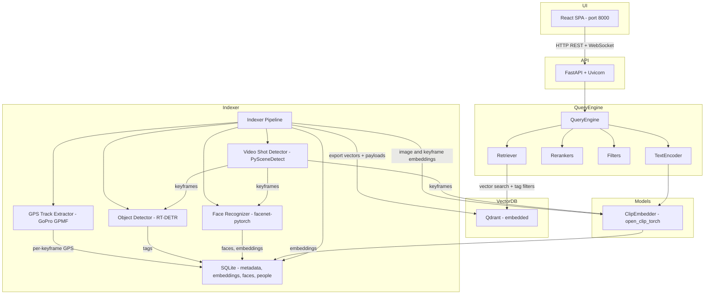
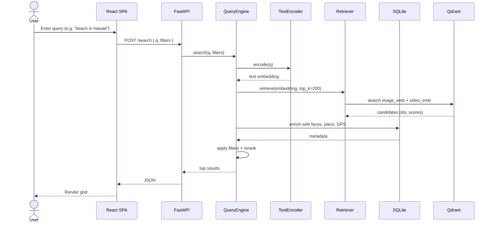
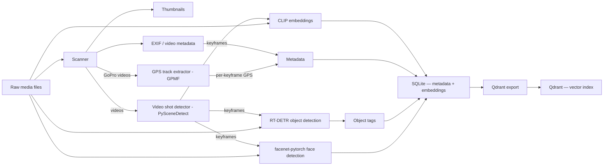
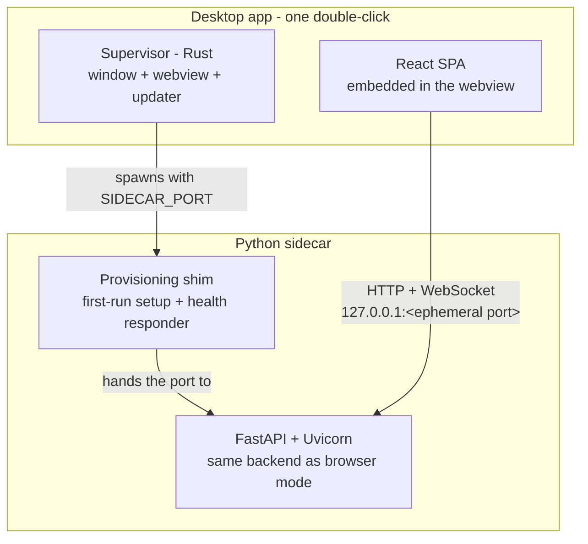
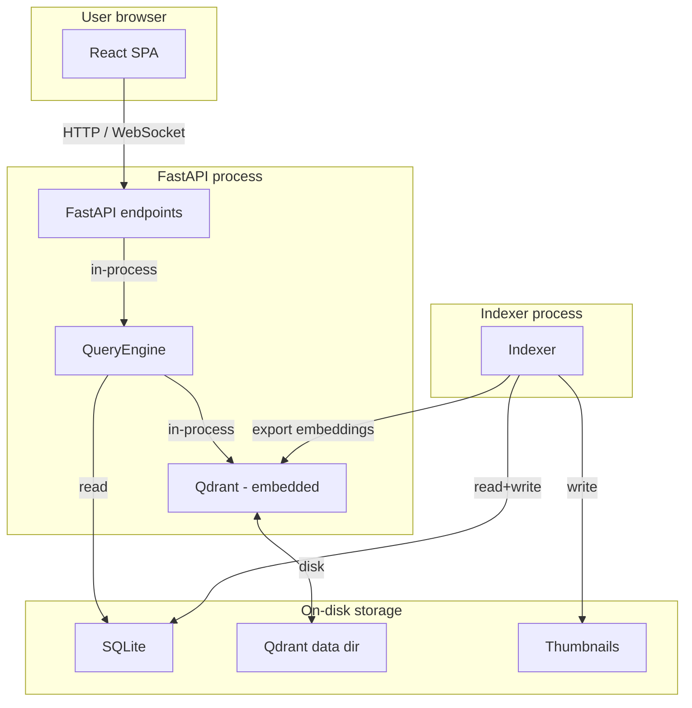

# Architecture

A high-level view of how Media Search Agent is wired together. Diagrams use
Mermaid and render directly on GitHub.

If you're a user, you don't need to read this — the [Quick Start](QUICKSTART.md)
covers everything. This page is for contributors and the curious.

## System overview

A single FastAPI process embeds the Qdrant vector database in-process — no
separate service, no Docker. The indexer is a separate process that writes
to the same on-disk stores. On macOS and Windows the FastAPI process runs as
a sidecar inside the native desktop app (see
[Desktop shell](#desktop-shell-macos--windows)); on Linux and headless
installs it serves the React UI directly in your browser at port 8000.

## Components

| Component | What it does |
|---|---|
| **React SPA** | Single-page UI for search, browse, indexer, people, settings. Built with Vite + TypeScript. Embedded in the desktop window on macOS/Windows; served as static assets by FastAPI in browser mode. |
| **FastAPI + Uvicorn** | HTTP/WebSocket API. Owns the process, embeds Qdrant, drives the QueryEngine. |
| **QueryEngine** | Encodes the query, runs vector retrieval, applies filters, reranks, returns the top results. Pure Python in-process. |
| **ClipEmbedder** | Image and text encoder (CLIP, default `ViT-L-14` weights). Drives both indexing and search. |
| **Object Detector** | RT-DETR (default `PekingU/rtdetr_r18vd`). Tags images and video keyframes. |
| **Face Recognizer** | facenet-pytorch (MTCNN detector + InceptionResnetV1 / VGGFace2 embeddings). Detects faces and writes embeddings used for clustering and "find similar". |
| **Video Shot Detector** | PySceneDetect content-aware shot boundary detection. Splits each video into shots, then samples representative keyframes per shot for the rest of the indexing pipeline. |
| **GPS Track Extractor** | Reads embedded GPS telemetry from action-cam videos (e.g. GoPro GPMF metadata tracks via `exiftool`). Per-keyframe coordinates align with the same shots picked by the shot detector, so a 10-shot clip ends up with up to 10 GPS points instead of one file-level coordinate. Stills use EXIF GPS as before. |
| **SQLite** | Canonical store. Holds media metadata, tags, faces, people, and embeddings (as float32 BLOBs). WAL mode + per-batch commits. |
| **Qdrant** | Vector index for fast nearest-neighbour search at query time. Embedded mode — stored on disk, no separate server. |
| **Indexer** | CLI process (`msa index run`). Walks media sources, hashes content, runs the model pipeline, and exports vectors to Qdrant. |

## Search request flow

The query path is entirely in-process apart from the Qdrant call (still
in-process because Qdrant is embedded — it just owns its own thread pool).

## Indexing flow

For each file the pipeline:

1. Hashes the bytes to derive a stable `media_id`.
2. Reads EXIF / video metadata (dates, GPS, camera, dimensions). For
   action-cam videos with embedded GPS tracks (e.g. GoPro GPMF), the GPS
   track extractor pulls per-second coordinates and aligns them to the
   shots picked by the shot detector — so a 10-shot clip ends up with up
   to 10 representative GPS points instead of one. All GPS points get
   reverse-geocoded to place names.
3. Writes a thumbnail to disk.
4. Runs the model pipeline:
   - **Images** — CLIP image embedding, RT-DETR objects, facenet-pytorch faces.
   - **Videos** — shot detection (PySceneDetect), then per keyframe: CLIP,
     RT-DETR, facenet-pytorch.
5. Commits everything to SQLite in batches (every 200 files / 15 s).
6. Exports the new embeddings + payloads to Qdrant.

The pipeline is incremental end to end. On the scan side, re-running the
indexer skips files whose size and modification time are unchanged and
reuses their stored identity without re-reading them. On the export side,
every write that affects a search payload stamps the affected embedding
rows with a sequence number, and the Qdrant export uploads only rows
stamped after the last recorded export — a run that changed one file
re-uploads one file's vectors, not the whole library. Deletions propagate
the same way: soft-deleted media carry a deletion stamp, and every export
removes their image, keyframe, and face points from Qdrant. If an export
fails partway (including a crash mid-run), the stamps survive and the next
run detects and exports exactly the missed rows before recording the new
export watermark.

## Storage layout

| Store | Role | On disk |
|---|---|---|
| **SQLite** (`media.sqlite`) | Canonical store: media metadata, tags, faces, people, and embeddings as float32 BLOBs. WAL mode for concurrent reads while indexing. | App data dir (see [INSTALL.md](INSTALL.md#what-it-installs-and-where)) |
| **Qdrant** (embedded) | Vector index for nearest-neighbour search across image, video keyframe, and face embeddings. Rebuilt from SQLite on demand. | Same data dir, separate subdirectory |
| **Thumbnails** | One small JPEG per indexed image, plus face crops. Written once, served by FastAPI. | Same data dir |

Embeddings are stored in SQLite as the source of truth; Qdrant is a derived
search index. If the Qdrant directory is deleted, it can be rebuilt from
SQLite without re-running the model pipeline.

## Models

All inference is local. First-run downloads pull weights from each model's
upstream distribution (OpenAI's CDN for CLIP, Hugging Face for RT-DETR,
the facenet-pytorch GitHub releases for facenet-pytorch); after that the
app works fully offline.

| Model | Purpose | License | Source |
|---|---|---|---|
| **CLIP** (`ViT-L-14`, OpenAI weights) | Image and text embeddings — the heart of semantic search | MIT | [open_clip_torch](https://github.com/mlfoundations/open_clip) |
| **RT-DETR** (`PekingU/rtdetr_r18vd`) | Object detection (80 COCO classes) | Apache-2.0 | [Hugging Face](https://huggingface.co/PekingU/rtdetr_r18vd) |
| **facenet-pytorch** (MTCNN + InceptionResnetV1, VGGFace2 weights) | Face detection and embedding | MIT | [timesler/facenet-pytorch](https://github.com/timesler/facenet-pytorch) |

Model selection is configurable — see [CONFIGURATION.md](CONFIGURATION.md).

## Desktop shell (macOS / Windows)

On macOS and Windows the app ships as a native desktop app built on
[Tauri](https://tauri.app/): a small Rust **supervisor** owns the window and
runs the same Python backend described above as a **sidecar** process. The
engine is identical across desktop and browser installs — the shell only
changes how it's launched and displayed.

The mechanics that matter:

- **Ephemeral port** — the supervisor picks a fresh `127.0.0.1` port on every
  launch and passes it to the sidecar. The desktop app has no fixed port, so
  it can never collide with another service (port 8000 is browser mode only).
- **`window.__API_BASE__` seam** — before the SPA loads, the supervisor
  injects the sidecar's base URL into the webview. All SPA fetches and
  WebSockets route through one helper that falls back to relative URLs when
  the seam is absent — which is exactly browser mode, byte-identical build.
- **Provisioning shim** — on first launch the sidecar entry installs a
  standalone CPython and the ML/Python dependencies with a bundled `uv` into
  an app-private directory, streaming stage-by-stage progress to the setup
  screen over the same port. The step ledger makes it resumable: a crash or
  quit mid-install continues where it left off on the next launch. Once the
  environment is ready, the shim starts uvicorn on the same port.
- **Clean lifecycle** — closing the window terminates the sidecar; a parent
  watchdog inside the sidecar exits if the supervisor ever dies first, so no
  orphaned Python processes either way. The indexer is the deliberate
  exception: it runs as a detached process, survives a window close, and the
  app re-attaches to it on relaunch.
- **No automatic updates** — the shell makes no unsolicited network request
  at launch; updating means installing a newer release yourself. The Tauri
  updater plugin stays registered but dormant, with minisign signature
  verification wired for a future user-initiated update check.

## Process boundaries

Two processes share three on-disk stores:

- The **API process** owns the embedded Qdrant instance and reads SQLite via
  a read-only connection (`query_only=1`, `busy_timeout=5000`) so a brief
  writer lock blocks rather than errors out.
- The **indexer process** is the only writer. It commits to SQLite in
  batches and exports new vectors to Qdrant.
- WAL mode lets the API see incremental indexing progress without restarts.

### Qdrant lock lifecycle during an indexing run

Embedded Qdrant uses a file lock only one process can hold. The indexer needs
that lock only for its final export step — the hours of scanning and model
work touch SQLite alone. The API therefore **keeps its embedded client open
for the whole run** and search keeps working against the pre-run index; the
lock changes hands only for the export window, via a sentinel-file handshake
in the run directory (the same file-based mechanism as the cooperative-stop
sentinel, so it behaves identically on Windows):

1. Before its first Qdrant open, the indexer writes `qdrant.request` and
   waits briefly for a grant.
2. `IndexerManager`'s watcher thread sees the request, drains in-flight
   Qdrant operations — waiting for any in-flight payload write to finish
   before anything else, since reads abandon safely but writes do not —
   closes the shared client, and writes `qdrant.granted` (echoing the
   request's run id, so a stale grant can never authorize a later run).
3. The indexer exports, then removes both files; the watcher reopens the
   shared client and resets the query engine so search sees the new
   collections. The SPA shows a "Finalizing index" banner during this window.

The watcher runs for the API's whole lifetime, so one contract covers a
fresh indexer launch, re-attach to an already-running indexer after an API
restart, and a standalone `msa index export` arriving while the API is
idle — the idle API still holds the embedded lock, and the manual-repair
export must be granted the window too. Fallbacks are bounded and loud:
with no API alive the indexer proceeds after a short timeout; if the lock
is genuinely held it retries with backoff and then skips the export with
an error, and the next run repairs the export automatically
(`msa index export` also works manually and uses the same handshake).
Stale handshake files from crashed runs are cleaned at startup, and a
request from a dead process is discarded. Setting `MSA_QDRANT_HANDOFF=off`
disables the handshake and restores the earlier behavior (the API closes
its client for the entire run).

While the export window is open, endpoints that would patch Qdrant payloads
(face labeling, person rename/merge) return a retryable 503 rather than
committing changes Qdrant would miss. Each of those writes holds the
shared-client guard across its whole SQLite commit + payload sync, so a
window opening mid-request queues the grant behind the write instead of
separating the commit from its sync: the watcher waits for in-flight
writes without the short reader-drain cap, up to a generous hard ceiling
that only a wedged write can hit. If that ceiling ever fires, the write
fails with the same retryable 503 instead of reporting success over a
missed payload patch — retrying the operation once the window closes
brings SQLite and Qdrant back in step.

## Where to look in the code

| Concern | Path |
|---|---|
| FastAPI app + endpoints | `src/msa_apps/search_api/app.py` |
| React UI | `src/msa_apps/ui/` (Vite + TypeScript) |
| Query engine | `src/msa_query/query_engine/` |
| Text/image encoders | `src/msa_query/embeddings/`, `src/msa_indexer/models/embeddings.py` |
| Object detection | `src/msa_indexer/models/objects.py` |
| Face detection / recognition | `src/msa_indexer/models/faces.py` |
| Video shot detection + GPS track extraction | `src/msa_indexer/io/video.py` |
| Indexer pipeline | `src/msa_indexer/` |
| SQLite schema and queries | `src/msa_indexer/db/sqlite_store.py` |
| Qdrant export and client | `src/msa_indexer/db/qdrant_export.py`, `src/msa_query/storage/qdrant_client.py` |
| Qdrant lock handshake (export window) | `src/msa_indexer/db/qdrant_handoff.py`, `IndexerManager` watcher in `src/msa_apps/search_api/indexer_manager.py` |
| Unified CLI (`msa`) | `src/msa_cli/` |
| Desktop shell — supervisor, sidecar shim | `src-tauri/`, `src/msa_apps/search_api/sidecar.py` |

API endpoints are also auto-documented at <http://localhost:8000/docs> when
the app is running (FastAPI's built-in Swagger UI).
