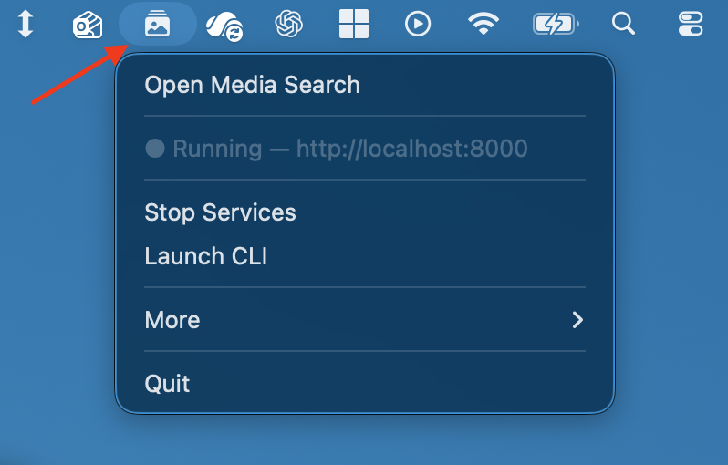
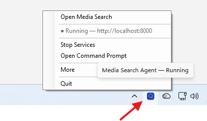

# Installation

Media Search Agent runs locally as a single FastAPI process serving a React
UI at port 8000. All ML inference (CLIP, RT-DETR, facenet-pytorch) happens
on your machine.

The supported install path is a one-line script that fetches the latest
release bundle from GitHub. No admin rights, no `git`, no Node, no system
Python required.

If you'd rather install from source for development, see
[Install from source (developers)](#install-from-source-developers) at the
bottom of this page.

## Requirements

| Platform | Minimum | Notes |
|---|---|---|
| **macOS** | 12 (Monterey), Apple Silicon | Self-contained — no Xcode, Homebrew, or system Python required. Intel Macs are not a supported target — release bundles are `macos-arm64` only. |
| **Windows** | 10/11 64-bit, PowerShell 5.1+ | NVIDIA GPU optional but strongly recommended. CUDA driver only — the installer pulls the CUDA-bundled PyTorch wheels. |
| **Linux** | x86_64, glibc 2.31+ (Ubuntu 22.04 / Fedora 36 or newer) | NVIDIA GPU optional. Tested on Ubuntu 22.04 (including WSL2). |

Disk: ~3 GB for the app + Python env + model weights. Your media library is
indexed in place and is never copied or moved.

RAM: 8 GB minimum, 16 GB+ comfortable for large libraries (50k+ items).

## Install — macOS / Linux

```bash
curl -fsSL https://github.com/openara-ai/media-search-agent/releases/latest/download/install.sh | bash
```

The installer:

- downloads the latest release bundle for your platform,
- bootstraps `uv` and a standalone CPython 3.12 in a private venv,
- installs all Python dependencies,
- registers a launch agent (macOS) so the app starts on login,
- launches the menu-bar app and opens <http://localhost:8000> in your browser.

The installer needs network access throughout — it pulls the release bundle
from GitHub and Python dependencies from PyPI. ML model weights are
downloaded the first time the app runs (see [First launch](#first-launch)).

The script is idempotent. Re-running it upgrades to the latest release and
preserves your existing config and indexed data.

## Install — Windows

```powershell
powershell -c "irm https://github.com/openara-ai/media-search-agent/releases/latest/download/install.ps1 | iex"
```

The installer:

- downloads the latest release bundle for Windows x64,
- bootstraps `uv` and a standalone CPython 3.12 under `%LOCALAPPDATA%\MediaSearchAgent`,
- installs the CUDA-bundled PyTorch and facenet-pytorch wheels,
- registers a Task Scheduler entry so the app starts on login,
- launches the tray app and opens <http://localhost:8000> in your browser.

It does not require admin rights and does not touch your system Python.

The installer needs network access throughout — it pulls the release bundle
from GitHub and Python dependencies from PyPI. ML model weights are
downloaded the first time the app runs (see [First launch](#first-launch)).

## What it installs and where

| Path | Contents |
|---|---|
| **macOS:** `~/Library/Application Support/MediaSearchAgent/` | App code, virtual env, runtime files |
| **macOS:** `~/MediaSearchAgent/` | Index (SQLite), thumbnails, `config.yaml`, logs |
| **Windows:** `%LOCALAPPDATA%\MediaSearchAgent\` | App code, venv, runtime files |
| **Windows:** `%USERPROFILE%\MediaSearchAgent\` | Index, thumbnails, `config.yaml`, logs |
| **Linux:** `~/.local/share/MediaSearchAgent/` | App code, venv, runtime files |
| **Linux:** `~/MediaSearchAgent/` | Index, thumbnails, `config.yaml`, logs |
| Model cache | `~/.cache/huggingface/` (RT-DETR), `~/.cache/clip/` (CLIP), `~/.cache/torch/checkpoints/` (facenet-pytorch) — ~1.5 GB total |

Your media folders are never copied or written to.

## First launch

- The browser opens automatically at <http://localhost:8000>. If it doesn't,
  visit that URL manually.
- On first launch the app downloads ~1.5 GB of model weights — CLIP from
  OpenAI's CDN, RT-DETR from Hugging Face, facenet-pytorch from its project
  GitHub releases. Allow 5–10 minutes on a typical home connection. Later
  launches start in seconds.
- Add a media folder on the **Indexer** page, then click **Run**. See
  [QUICKSTART.md](QUICKSTART.md) for the walkthrough.

## Menu bar / system tray app

After install, Media Search Agent runs in the background and is controlled
from a small icon in the system menu bar (macOS) or system tray (Windows).
Click the icon to see status and run common actions without going to the
terminal.

**macOS — menu bar app** (native Swift `NSStatusItem`, no Dock icon). Look
for the picture-frame icon at the top of your screen — clicking it opens
the menu shown below:



**Windows — system tray app** (single-file self-contained .NET). Look
for the magnifying-glass icon in the system tray (bottom-right of the
taskbar, sometimes hidden under the `^` overflow arrow). Right-click it
to open the menu:



Both apps expose the same items:

| Item | What it does |
|---|---|
| **Open Media Search** | Opens <http://localhost:8000> in your default browser. |
| **● Running / ○ Stopped** | Live status indicator. |
| **Start / Stop Services** | Starts or stops the FastAPI process. |
| **Launch CLI** *(macOS)* / **Open Command Prompt** *(Windows)* | Opens a shell with the app's `msa` CLI on the path — useful for `msa index run`, `msa uninstall`, etc. |
| **More → View Logs** | Tails the API logs in a new terminal window. |
| **More → Start on Login** | Toggles auto-start at login (registered as a launch agent on macOS, Task Scheduler entry on Windows). |
| **More → Uninstall…** | Runs the uninstaller. |
| **More → Version** | Shows the installed version. |
| **Quit** | Stops the services and exits the menu-bar / tray app. |

The app starts automatically the first time you install and re-launches on
login by default. To stop it without uninstalling, click **Quit**.

After **Quit** the icon disappears from the menu bar / tray. To bring it
back:

- **macOS** — open `MediaSearchAgent` from Spotlight (`⌘ Space`), or
  double-click `~/Applications/MediaSearchAgent.app` in Finder.
- **Windows** — open the **Start Menu** and click "Media Search Agent".

The icon will also reappear automatically on the next login if
**Start on Login** is enabled (the default).

## Updating

Re-run the same one-liner. Existing config, index, and labeled people are
preserved.

```bash
# macOS / Linux
curl -fsSL https://github.com/openara-ai/media-search-agent/releases/latest/download/install.sh | bash
```

```powershell
# Windows
powershell -c "irm https://github.com/openara-ai/media-search-agent/releases/latest/download/install.ps1 | iex"
```

## Uninstall

The app keeps app code, runtime data, and your media library in three
separate places. The runtime can be removed without touching the others.

**macOS / Linux:**

```bash
msa uninstall
```

**Windows:** use the uninstaller shipped with the install — open
`%LOCALAPPDATA%\MediaSearchAgent\` and run `uninstall.ps1`, or use the
"Uninstall Media Search Agent" entry in the Start Menu.

To remove everything manually after the uninstaller runs:

- Delete the data dir (paths in the table above) if you also want to drop
  your index and thumbnails.
- Optionally delete the model caches (`~/.cache/huggingface/`,
  `~/.cache/clip/`, `~/.cache/torch/checkpoints/`).

Your media library is never touched.

## Troubleshooting

**"port 8000 already in use"** — another app (or a previous run) is bound to
the port. Find it with `lsof -i :8000` (macOS/Linux) or
`Get-NetTCPConnection -LocalPort 8000` (Windows) and stop it, or override the
port in `config.yaml`.

**Models take forever to download / fail partway** — first-run downloads
total ~1.5 GB across three sources (OpenAI's CDN, Hugging Face, and the
facenet-pytorch GitHub releases). If a download dies, re-run the installer
or relaunch the app — each downloader resumes where it left off. On a slow
link, expect 5–15 minutes.

**Windows: GPU not detected / inference is slow** — install or update your
NVIDIA driver from <https://www.nvidia.com/Download/index.aspx> (you do not
need the full CUDA Toolkit — driver only). Confirm with `nvidia-smi`.

**Linux: missing `libGL` / `libglib`** — install the standard image libs:
`sudo apt install libgl1 libglib2.0-0`.

**Search returns nothing** — semantic search comes online when the indexer
finishes; queries run while indexing is still in progress will be empty.
Wait for the run to complete, then retry. If the **Indexer** page shows
zero items and zero progress at all, check that the path you added is
readable and contains supported formats (`.jpg`, `.jpeg`, `.png`, `.heic`,
`.mp4`, `.mov`).

For anything not covered here, check [the FAQ](FAQ.md) or open an issue on
[GitHub](https://github.com/openara-ai/media-search-agent/issues).

## Install from source (developers)

The web installer is the path for end users. Contributors typically work
from a checkout instead:

```bash
git clone https://github.com/openara-ai/media-search-agent.git
cd media-search-agent
bash scripts/dev-setup.sh    # idempotent; ~5–10 min on first run
bash scripts/start.sh        # opens http://localhost:8500 (different from end-user)
```

Supported dev environments are **macOS** and **WSL2 / Linux**. There is no
Windows-native dev path — Windows contributors should work inside a WSL2
Ubuntu shell and follow the commands above.

After `git pull`, re-run `bash scripts/dev-setup.sh` to pick up new
dependencies. See the [Contributing section](../README.md#contributing) in
the README for the full dev workflow.
