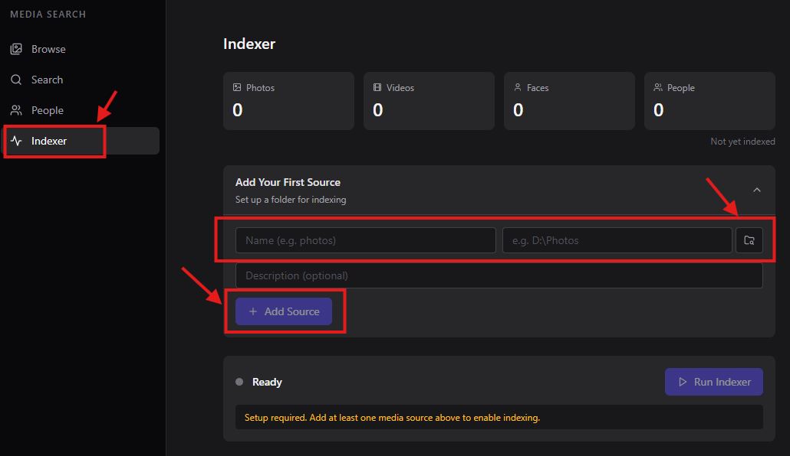
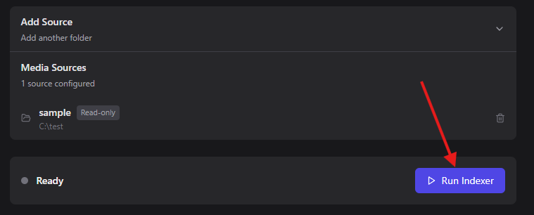

# Quick Start

A short walkthrough from zero to your first semantic search.

By the end you'll have Media Search Agent running, indexing a folder of your
photos, and answering natural-language queries.

## 1. Install

**macOS (Apple Silicon)** — download the latest **`.dmg`** from the
[Releases page](https://github.com/openara-ai/media-search-agent/releases/latest),
drag **MediaSearchAgent** into Applications, and launch it.

**Windows 11** — download the latest **`setup.exe`** from the
[Releases page](https://github.com/openara-ai/media-search-agent/releases/latest)
and run it (per-user, no admin). Launch **MediaSearchAgent** from the Start
menu.

**Linux (x86_64)** — one line; serves the UI in your browser at
<http://localhost:8000>:

```bash
curl -fsSL https://github.com/openara-ai/media-search-agent/releases/latest/download/install.sh | bash
```

No admin rights, no git, no Node, no system Python required.

For platform requirements, the terminal one-liners for macOS/Windows,
headless installs, troubleshooting, and uninstall, see
[INSTALL.md](INSTALL.md).

## 2. First launch

The app window opens immediately with a setup screen. On first run it
downloads its Python runtime, ML libraries, and model weights (~3.5 GB total,
sized to your hardware) with live progress for each stage — allow several
minutes on a typical home connection. Setup runs once; later launches start
in seconds. If it's interrupted, the next launch resumes where it left off.

On macOS and Windows the app is a normal desktop window — closing it stops
the app (a running indexing job keeps going in the background and reconnects
when you relaunch). On Linux, the UI lives in your browser at
<http://localhost:8000>.

The desktop app keeps itself up to date automatically — see
[INSTALL.md](INSTALL.md#updating).

## 3. Add a media folder

1. Click **Indexer** in the navigation.
2. Click **Add media source**.
3. Use the directory picker to navigate to a folder of photos or videos
   (Pictures, a Photos library export, an external drive — anything works).
4. Leave **Read-only** turned on (the default — the app never writes to your
   library).
5. Click **Save**.



You can add more than one source from the same Indexer page. They all index
into the same searchable library.

## 4. Start indexing

Still on the **Indexer** page, click **Run**.



You'll see live progress — file counts, current stage (CLIP embeddings, object
detection, faces), and a streaming log. Indexing speed varies a lot with
hardware (NVIDIA GPU > Apple Silicon > CPU-only), media size, and which
detectors are enabled — see the [FAQ](FAQ.md#indexing) for details.

**Browse** works while indexing is running — new items appear in the grid
as they're processed. **Search** comes online once the run completes.

## 5. Search

Click **Search** and type a natural-language query. A few that work well:

- `sunset over water`
- `kids playing in snow`
- `person holding a coffee cup`
- `dog on a beach`
- `red car at night`

Drag the **threshold slider** to filter by similarity score. Click any result
to open it in the detail drawer with EXIF, GPS, and detected faces.

## 6. Browse by face

Click **People** to see automatically-clustered identities. Click a face to
browse all photos of that person, or label the cluster with a name to make
that person searchable.

## Where to go next

- [Configuration](CONFIGURATION.md) — `config.yaml` reference (models, ports, thresholds)
- [CLI reference](CLI.md) — drive the indexer and API server from the terminal (headless/Linux installs)
- [Search guide](features/search.md) — how scoring works, query tips
- [People guide](features/people.md) — face labeling workflow
- [Video guide](features/video.md) — semantic search across video keyframes
- [FAQ](FAQ.md) — privacy, hardware, supported formats, common questions
