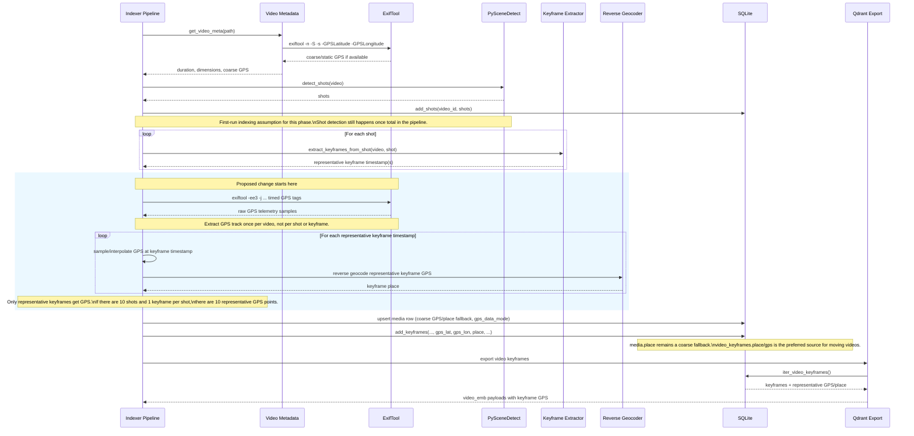

# Spike: GoPro Video GPS Track Support

**Goal:** Design a correct way to extract representative GPS for moving videos,
especially GoPro MP4 files where telemetry is stored as a timed metadata track
instead of a single file-level coordinate.

**Decision it feeds:** Whether video GPS in Media Search Agent should remain a
single `media.gps_lat/gps_lon` value, or move to a per-keyframe GPS model that
matches the existing shot/keyframe indexing pipeline.

**Status:** Proposed design and implementation plan. No production code yet.

---

## Key Invariant

1. Video shot detection must be carried out only once in the entire pipeline.
   The current pipeline already does this with PySceneDetect. GPS extraction must
   reuse those shot/keyframe timestamps or use an approach that also works when
   the existing shot detection result is reused from SQLite. It must not trigger
   a second shot detection pass.
2. Only representative keyframes for shots will have GPS data.
   GPS is attached to the same keyframes already chosen by the existing video
   indexing flow. If a video has 10 shots and the pipeline is configured for 1
   keyframe per shot, the result should be 10 keyframes with 10 representative
   GPS points. GPS should not be attached to arbitrary non-representative frames.

---

## Summary

GoPro videos do not behave like photos with one EXIF GPS point. The camera writes
telemetry as a time series in a separate MP4 metadata track. In this app, the best
representative location for a video result is therefore the GPS sample associated
with the result's representative keyframe timestamp.

The current pipeline already gives us that anchor:

- shot boundaries are stored in `shots`
- representative keyframe timestamps are stored in `video_keyframes.timestamp`
- search results for videos already resolve to a specific keyframe timestamp

So the right model is:

1. Extract the full GPS track from the video.
2. Normalize it into time-stamped GPS samples.
3. Resolve a representative GPS point for each stored keyframe timestamp.
4. Store GPS on `video_keyframes`, not only on `media`.

Important constraint: this design does not introduce a second shot-detection
phase. It attaches GPS to the timestamps already produced by the current
shot-detection and keyframe-selection pipeline.

Important scope boundary: this design stores GPS only for representative
keyframes, not for every telemetry sample and not for arbitrary decoded frames.

Assumption for this phase: treat this as part of the first-run indexing path for
media. There is no requirement to compute or backfill representative GPS for
videos that were indexed before this feature existed.

---

## Sequence Diagram

The diagram below shows the current video indexing flow and where the proposed GPS
track support plugs into it.



### Reading the diagram

- The existing PySceneDetect pass remains the only shot-detection pass.
- The diagram reflects first-run indexing only for this phase.
- The proposed GPS work is attached after shot/keyframe selection, not before it.
- Timed GPS extraction runs once per video.
- GPS is reduced onto the already-selected representative keyframes.
- Media-level GPS/place remains available as a coarse fallback.

---

## Current State

### What exists today

- `src/msa_indexer/io/video.py`
  - `get_video_meta(path)` extracts duration, dimensions, and a coarse GPS point.
  - `_extract_gps_with_exiftool(path)` tries to read `GPSLatitude` and
    `GPSLongitude` once from the file.
- `src/msa_indexer/pipeline.py`
  - reads video metadata before indexing
  - stores `media.gps_lat/gps_lon/place`
  - detects shots and stores representative keyframe timestamps per shot
- `src/msa_indexer/db/schema.sql`
  - `media` has `gps_lat`, `gps_lon`, `place`
  - `video_keyframes` has `timestamp`, `shot_start`, `shot_end`, `tags`
- `src/msa_indexer/db/qdrant_export.py`
  - exports video keyframes to Qdrant with `timestamp`, `shot_start`, `shot_end`,
    `tags`, `place`, `people`

### Limitation

The current design assumes a video can be represented by one GPS point at the
media row level. That is acceptable for static clips or iPhone-style file-level
QuickTime location metadata, but it is lossy for moving cameras and specifically
wrong for GoPro telemetry tracks.

---

## Research Findings

### 1. GoPro stores telemetry as timed metadata, not one static GPS value

GoPro documents GPMF as a timed metadata stream embedded in MP4 files. GPS is
stored as sample-based telemetry (`GPS5` / `GPS9`) associated with the telemetry
track rather than a single file-level coordinate.

Primary source:

- GoPro GPMF parser repository:
  - https://github.com/gopro/gpmf-parser

### 2. ExifTool only exposes the full GPS track when `-ee` is enabled

ExifTool documents `-ee[NUM]` as the switch that extracts timed metadata in
videos. Its geotagging documentation explicitly notes that `-ee3` is required to
extract the full track from video files.

Primary sources:

- ExifTool application docs:
  - https://exiftool.org/exiftool_pod2.html
- ExifTool geotagging docs:
  - https://www.exiftool.org/geotag.html

### 3. ExifTool treats timed metadata samples as separate embedded documents

ExifTool's family 3 grouping identifies timed metadata samples in videos as
separate embedded documents. This is important because repeated GPS values are not
one flat tag set; they are a stream of records.

Primary source:

- ExifTool docs:
  - https://www.exiftool.org/ExifTool.html

### 4. The current fallback in `get_video_meta()` is too coarse for GoPro

The current code calls:

```bash
exiftool -n -S -s -GPSLatitude -GPSLongitude <file>
```

That can return a coarse composite/static coordinate when available, but it does
not ask for embedded timed telemetry. For GoPro videos, this misses the actual
track semantics.

### 5. Existing keyframe timestamps are already the right representative anchor

The video search system already stores:

- shot start and end
- representative keyframe timestamp within each shot

That means we do not need a new heuristic for "representative location". We should
sample the telemetry track at the already chosen keyframe timestamp.

This also means we must not run another scene/shot analysis pass for GPS. The GPS
path should plug into the existing shot/keyframe flow only.

---

## Design Decision

### Chosen model

Use **per-keyframe GPS** as the canonical representation for moving-video search
results.

More precisely: use **representative-keyframe GPS** as the canonical
representation for moving-video search results.

### Why this is the best fit

- search results already represent one moment in a video, not the entire clip
- shot browsing already uses `video_keyframes.timestamp`
- GoPro telemetry is a time series, so it should be sampled by time
- the design leaves room for future route/map views without another schema change

### What stays the same

- keep `media.gps_lat/gps_lon/place` for:
  - images
  - videos that only expose one static location
  - coarse fallback

### What changes

- `video_keyframes` gains its own GPS fields
- the indexer resolves GPS at keyframe time
- Qdrant export and API responses return keyframe GPS for video hits
- GPS density matches representative keyframe density, not raw telemetry density
- GPS presence/debugging should distinguish coarse media-level GPS from
  representative-keyframe GPS

---

## GPS Presence Flag

For debugging, API clarity, and UI behavior, it is useful to expose GPS presence
as more than a boolean.

In the current repo, the media table already has `gps_processed`, which means the
GPS extraction stage was attempted for a media item. That field is useful and
should remain, but it is not expressive enough to describe what kind of GPS data
is actually present.

### Recommendation

Keep `gps_processed` for pipeline bookkeeping, and add a second field on `media`
that communicates *what kind* of GPS data is present:

```sql
ALTER TABLE media ADD COLUMN gps_data_mode TEXT;
```

Use enum-style values such as:

```text
none
media_static
keyframe_representative
media_static_plus_keyframe
```

Suggested meaning:

- `none`
  - no usable GPS data found
- `media_static`
  - only coarse media-level GPS is available
  - typical for photos and some videos with one static coordinate
- `keyframe_representative`
  - representative keyframe GPS is available and should be preferred for video
    results
- `media_static_plus_keyframe`
  - both coarse media-level GPS and representative keyframe GPS are available

### Why this helps

- avoids ambiguity in debugging and logs
- makes it obvious whether a video is still using fallback media GPS only
- helps the UI choose whether to show a coarse video place or a
  representative-keyframe place
- avoids overloading `gps_processed`, which answers "did the GPS stage run?"
  rather than "what GPS shape do we have?"

### Recommended semantics

- `gps_processed = 0`
  - GPS extraction has not yet been attempted
- `gps_processed = 1`, `gps_data_mode = 'none'`
  - GPS stage ran, but no usable GPS was found
- `gps_processed = 1`, `gps_data_mode = 'media_static'`
  - only coarse media-level GPS is available
- `gps_processed = 1`, `gps_data_mode = 'keyframe_representative'`
  - representative keyframe GPS is available and should be preferred
- `gps_processed = 1`, `gps_data_mode = 'media_static_plus_keyframe'`
  - both coarse media-level GPS and representative keyframe GPS are available

### API/UI compatibility note

If an existing API/UI boolean such as `hasGPSData` exists and must be preserved,
keep:

- `hasGPSData: true/false`
- plus a second field such as `gpsDataMode` or `gpsDataKind`

That gives us backwards compatibility while still exposing the richer state needed
for debugging and support. The SQLite storage model should remain
`gps_processed` + `gps_data_mode`.

### Interaction with the fallback media place rule

If `media.place` is backfilled from the first non-null representative keyframe
place for compatibility, the enum should still report the true source of GPS:

- do **not** collapse `keyframe_representative` into `media_static`
- the enum should describe the underlying GPS model, not just whether
  `media.place` happens to be populated

---

## Proposed Data Model

### Option A: Minimal, recommended for first implementation

Add GPS fields directly to `video_keyframes`:

```sql
ALTER TABLE video_keyframes ADD COLUMN gps_lat REAL;
ALTER TABLE video_keyframes ADD COLUMN gps_lon REAL;
ALTER TABLE video_keyframes ADD COLUMN gps_alt REAL;
ALTER TABLE video_keyframes ADD COLUMN gps_datetime_utc TEXT;
ALTER TABLE video_keyframes ADD COLUMN gps_dop REAL;
ALTER TABLE video_keyframes ADD COLUMN gps_fix INTEGER;
ALTER TABLE video_keyframes ADD COLUMN gps_source TEXT;
ALTER TABLE video_keyframes ADD COLUMN place TEXT;
```

Pros:

- simple migration
- enough for search and shot detail UI
- no extra join required to show representative location
- exactly matches the invariant that only representative keyframes carry GPS

Cons:

- loses the full raw track unless separately preserved

### Option B: Recommended follow-on for richer map features

Add a raw telemetry table:

```sql
CREATE TABLE video_gps_points (
  id INTEGER PRIMARY KEY AUTOINCREMENT,
  video_id TEXT NOT NULL,
  sample_index INTEGER NOT NULL,
  t_offset_sec REAL NOT NULL,
  gps_datetime_utc TEXT,
  gps_lat REAL NOT NULL,
  gps_lon REAL NOT NULL,
  gps_alt REAL,
  gps_dop REAL,
  gps_fix INTEGER,
  gps_source TEXT,
  UNIQUE (video_id, sample_index)
);
```

Pros:

- preserves the full route
- supports future map/scrubber UI and telemetry diagnostics
- makes re-sampling keyframes cheap after parser improvements

Cons:

- slightly more schema and migration work

### Recommendation

Implement both if time allows. If we need a smaller first cut, start with Option A
and leave the table stubbed in the design.

Even if Option B is added later, the main search/indexing contract remains the
same: only representative keyframes get first-class GPS fields used by search
results.

---

## GPS Resolution Rules

Given a normalized GPS sample stream:

```text
[
  {t=0.00, lat=..., lon=...},
  {t=0.20, lat=..., lon=...},
  {t=0.40, lat=..., lon=...}
]
```

And a keyframe timestamp:

```text
t_keyframe = 12.84
```

Resolve the representative keyframe GPS as follows:

1. Find valid samples immediately before and after `t_keyframe`.
2. If both exist and the gap is small enough, linearly interpolate latitude,
   longitude, and altitude.
3. If only one valid sample is close enough, use nearest-sample fallback.
4. If the nearest sample is too far away, return no GPS for that keyframe.

This is intentionally a many-samples-to-one-keyframe reduction step. Raw
telemetry may contain hundreds or thousands of samples, but the search-facing
result is one representative GPS point per representative keyframe.

### Proposed thresholds

- interpolation max gap: `<= 2.0s`
- nearest fallback max distance: `<= 1.0s`
- require valid fix when available

### Why interpolation is preferred

GoPro sample rate is usually much higher than shot/keyframe density. Interpolation
gives a more stable representative point when the keyframe lands between telemetry
samples.

---

## Extraction Strategy

### First choice: ExifTool

Use ExifTool because:

- it is already part of the project's ecosystem
- installers already bundle it
- it understands GoPro timed metadata with `-ee3`
- it works across platforms without custom MP4/GPMF parsing in Python

### Probe command for the spike

```bash
exiftool -ee3 -n -j -api LargeFileSupport=1 \
  -GPSDateTime -GPSLatitude -GPSLongitude -GPSAltitude \
  -GPSHPositioningError -GPSMeasureMode -GPSStatus -SampleTime \
  /path/to/GX010123.MP4
```

### Expected normalization target

Each telemetry sample should be normalized into:

```python
{
    "sample_index": 42,
    "t_offset_sec": 12.84,
    "gps_datetime_utc": "2024-07-13T18:42:11.240000+00:00",
    "gps_lat": 37.42123,
    "gps_lon": -122.08452,
    "gps_alt": 14.1,
    "gps_dop": 0.9,
    "gps_fix": 3,
    "gps_source": "exiftool-ee3",
}
```

### Fallback strategy

If `-ee3` yields no track:

1. keep current MediaInfo/QuickTime ISO6709 scan
2. keep current coarse `GPSLatitude/GPSLongitude` fallback
3. populate only media-level GPS

This preserves support for videos that expose one static coordinate but no timed
track.

---

## Integration Plan

### 1. Video metadata layer

File: `src/msa_indexer/io/video.py`

Add:

- `extract_video_gps_track(path) -> list[dict]`
- `sample_video_gps_at_timestamps(samples, timestamps) -> list[dict | None]`
- helper parsers for:
  - `SampleTime`
  - `GPSDateTime`
  - fix/mode normalization

Keep:

- `get_video_meta(path)` for duration, dimensions, and coarse fallback GPS

### 2. SQLite schema and migrations

Files:

- `src/msa_indexer/db/schema.sql`
- `src/msa_indexer/db/sqlite_store.py`

Add:

- `video_keyframes` GPS columns
- optional `video_gps_points` table
- `media.gps_data_mode TEXT`

Migration behavior:

- safe additive columns/tables only
- no required backfill path for already-indexed videos in this phase
- assume the representative-GPS path is exercised during first-time indexing

### 3. Indexer pipeline

File: `src/msa_indexer/pipeline.py`

For each video:

1. read duration/dimensions/coarse GPS via `get_video_meta()`
2. try `extract_video_gps_track()`
3. use the existing shot detection result already produced by the current video
   indexing flow
4. use the existing keyframe timestamps already produced for each shot
5. resolve representative GPS per keyframe timestamp
6. store GPS with each keyframe row
7. optionally persist the full raw track

Important detail:

- GPS-track extraction should happen once per video before the keyframe loop
- shot detection should still happen once total, exactly as it does today
- if shots are already present in SQLite and the pipeline reuses them, GPS
  sampling must reuse those stored shots and the resulting keyframe timestamps
  rather than re-running PySceneDetect

### Pipeline invariant in practical terms

The GPS implementation must fit this existing control flow:

- if the current pipeline reuses `existing_shots`, GPS code must reuse them too
- if the current pipeline runs PySceneDetect because shots do not exist yet, GPS
  code may consume the resulting in-memory shots from that same pass
- GPS code may derive representative timestamps from the same
  `extract_keyframes_from_shot()` output already used for embeddings and tags
- GPS code must never call PySceneDetect independently
- GPS code must only persist GPS for those representative keyframes, not for
  arbitrary timestamps outside the existing keyframe set

### 4. Qdrant export

File: `src/msa_indexer/db/qdrant_export.py`

Add to video keyframe payload:

- `gps_lat`
- `gps_lon`
- `gps_alt`
- `gps_datetime_utc`
- `place`

### 5. Query/API layer

Files:

- `src/msa_query/storage/qdrant_client.py`
- `src/msa_apps/search_api/schemas.py`
- `src/msa_apps/search_api/app.py`

Behavior:

- video hits should return keyframe GPS
- video shot detail endpoint should expose per-keyframe GPS
- existing image response shape can stay unchanged

### 6. Reverse geocoding

Current behavior reverse-geocodes at the media row level.

For videos:

- if keyframe GPS exists, derive `video_keyframes.place`
- keep `media.place` as coarse/fallback

This avoids showing one misleading place for a moving video result.

---

## Testing Plan

### Unit tests

Add parser tests for:

- `SampleTime` parsing
- `GPSDateTime` parsing
- interpolation between telemetry samples
- nearest fallback behavior
- invalid fix / gap-too-large behavior

### Fixture tests

Start with canned ExifTool JSON fixtures:

- avoid requiring a large GoPro video in the repo
- make parser behavior deterministic

Later, add one trimmed public GoPro-like sample if licensing and size are workable.

### Integration tests

Add coverage for:

- `get_video_meta()` still returns coarse fallback GPS
- `extract_video_gps_track()` returns ordered samples
- video keyframe rows persist GPS
- Qdrant export includes video keyframe GPS payloads

### Manual validation

Run the spike script against a real GoPro MP4 and compare:

- telemetry points count
- sampled keyframe GPS
- one or two timestamps against ExifTool raw output

---

## Risks and Open Questions

### 1. Exact ExifTool JSON shape may vary by source file

The spike should validate the exact field names and record shape from a real GoPro
file before production parsing code is finalized.

### 2. GPS status and fix quality vary by device/firmware

We should treat fields like `GPSStatus`, `GPSMeasureMode`, or accuracy/DOP as
best-effort signals, not hard requirements in v1.

### 3. Place at video level may become misleading

For a moving clip, one `media.place` is inherently lossy. We should preserve it for
fallback/backwards compatibility but prefer `video_keyframes.place` in video result
rendering once available.

### 4. Performance

`-ee3` is more expensive than current coarse extraction. The design should:

- run it once per video
- only during first-time indexing for this feature scope
- avoid calling ExifTool separately per keyframe

### Measured spike result

A timing spike against a longer GoPro video produced the following:

```text
ffprobe data-stream probe :       29 ms
coarse exiftool GPS read  :       78 ms
full exiftool -ee3 read   :     1786 ms
shot detection            :   161969 ms
ee3 / shot-detect ratio   :    0.011x
video duration            :   384.38 s
ee3 ms per sec of video   :     4.65
```

Interpretation:

- the full `exiftool -ee3` telemetry pass was about 1.8 seconds on a 384-second
  clip
- that is about 4.65 ms per second of video
- most importantly, it was only about 1.1% of shot-detection cost on that test
  clip

Conclusion from the spike:

- a once-per-video ExifTool telemetry pass appears acceptable for v1
- it is materially slower than coarse metadata reads, but still tiny compared to
  PySceneDetect on a long clip
- based on this result, performance alone is not a strong reason to block the
  representative-keyframe GPS design
- a future random-access parser may still be worthwhile for polish or for very
  large-scale libraries, but it is not required to make the first implementation
  viable

---

## Recommendation

Proceed with implementation using this order:

1. Spike against a real GoPro MP4 with the sample script.
2. Add parser helpers in `src/msa_indexer/io/video.py`.
3. Add additive schema changes for `video_keyframes.gps_*`.
4. Attach representative GPS while building keyframe rows.
5. Export video GPS through Qdrant and API responses.
6. Optionally add `video_gps_points` if we want future route/map support now.

This gives correct search-time GPS for GoPro footage without disturbing the existing
shot/keyframe architecture.
